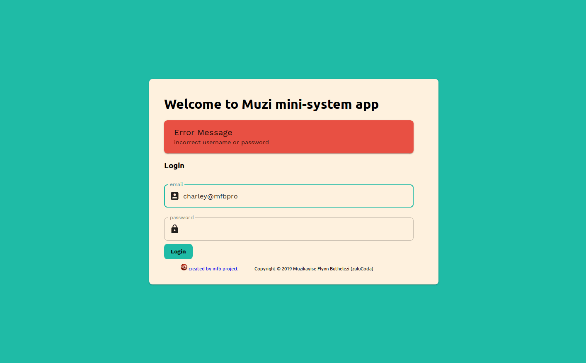
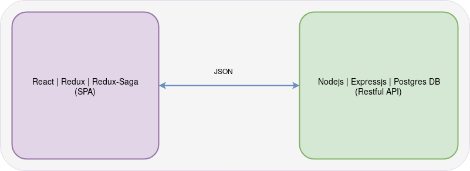

# zulucoda mini-system-app

This is my solution to the SellAnyCar Front-end challenge.

## Demo
Live demo [https://muzi-mini-system.mfbproject.co.za/](https://muzi-mini-system.mfbproject.co.za/)

## Projects
1. Front-end React - https://github.com/zulucoda/muzi-mini-system-app
2. Back-End Nodejs - https://github.com/zulucoda/muzi-mini-system-api

## Architecture Simple Overview
The Front-end SPA consumes the Back-end Restful API using JSON data.

## Solution / Tech Stack
### Front-end
The project was created using `create-react-app`. This project conforms to the [Air BnB style guide's](https://github.com/airbnb/javascript) naming and coding-style conventions, with special tweaks. [For more info, please see my development tool-belt blog post](https://blog.mfbproject.co.za/2019/01/19/my-current-software-development-tool-belt/).

Other:
* I use `redux` for state management. My personal opinion: Always use `redux` for state management. [Check out my blog article on this](https://blog.mfbproject.co.za/2018/03/11/so-you-want-to-know-what-you-should-test-when-using-react/)
* I use `redux-saga` for `redux` middleware, and it works well. [Please see my blog post on `redux-saga` for more info.](https://blog.mfbproject.co.za/2019/01/27/a-deep-dive-into-why-i-use-redux-saga/)
* `Prettier` - Automatically formats code after every commit.

Not considered for this challenge, however worth mentioning:
* Tests have not created. However, if this where a production app tests would be written for `reducers, sagas, containers & views`.
* `Typescript` has no been used. However, it is recommended for production applications.

### Back-end
The node API was generated using the express generator. The node project makes use of the MVC and modular pattern.

Other:
* I use `expressjs` web framework to create a simple Restful API.
* I used `sequelize` as ORM for `PostgreSQL` DB. Using `sequelize-cli` to generate modules, which acts as a repository pattern.

Not considered for this challenge, however worth mentioning:
* `Typescript` has no been used. However, it is recommended for production applications.

---------------------
## Setup Prerequisites
* node version `v10.15.0`
* yarn version `1.13.0`
* OS Ubuntu Linux 18.04 LTS

## Back-end Code Setup
To run the back-end locally, you'll need `PostgreSQL` DB to be installed.

1. Clone repo: `$ git clone https://github.com/zulucoda/muzi-mini-system-api`
2. Install dependencies: `$ yarn`
3. Create db using `sequelize-cli`: `$ node_modules/.bin/sequelize db:create`
4. Run db migrations `sequelize-cli`: `$ node_modules/.bin/sequelize db:migrate`
5. Seed the database with user `sequelize-cli`: `$ node_modules/.bin/sequelize db:seed:all`
6. Start in dev: `$ yarn start:dev`

## Front-end Code Setup

1. Clone repo: `yarn git clone https://github.com/zulucoda/muzi-mini-system-app`
2. Install dependencies: `$ yarn`
3. Start: `$ yarn start`
